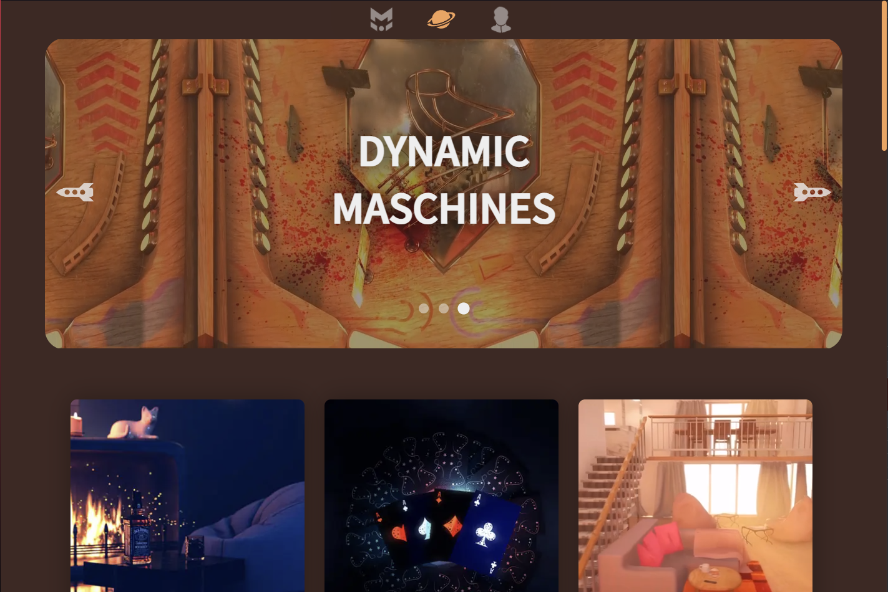

# Marcus Universe

<p align="center">
<a target="_blank" href="https://marcus-universe.de">  </a>
</p>
<p align="center">
This is my <b>webportfolio</b> build in <b>Vue3</b> and can be looked at 
<br>
<a target="_blank" href="https://marcus-universe.de"><b>marcus-universe.de</b></a>
</p>




## Project setup

```
npm install
```

### Compiles and hot-reloads for development

```
npm run serve
```

### Compiles and minifies for production

```
npm run build
```
